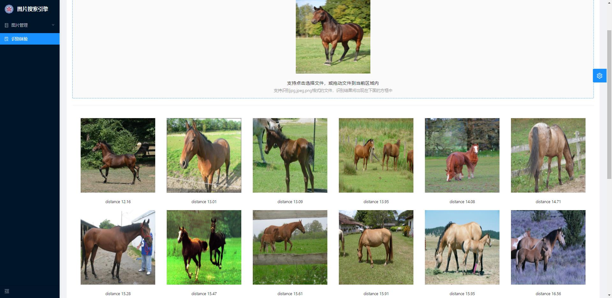

# 简易图片搜索引擎

### 特性

- 后端：flask框架 
- 前端：ant design pro v5
- 向量数据库：milvus
- 特征提取：towhee
- 默认图片向量模型：resnet50
- 主要功能模块：图片入库，相似图片搜索

### 安装

```
//使用docker-compose一键启动
docker-compose up -d
```

### 访问

容器运行成功后，访问：http://ip:8899/
初始账号: admin 密码: admin

# 使用截图

- 识别体验
  


